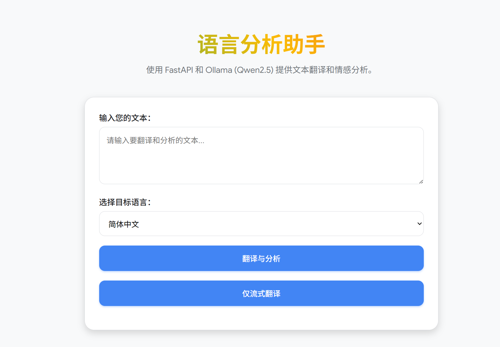

# 🚀 语言分析助手 (LangChain LCEL Powerhouse)



> 本项目使用FastApi 构建的 LLM 语言分析服务，基于 LangChain 的 LCEL 模式实现,仅用于测试，请勿用于生产环境。

## ✨ 核心亮点与特性

  * **⚡️ 极速流式响应 (Streaming):** 利用 FastAPI 的 `StreamingResponse` 和 LangChain 的 `.astream()`，用户可以实时看到翻译结果，极大地提升了用户体验，解决了 LLM 的感知延迟问题。
  * **🧱 强制结构化输出:** 使用 **PydanticOutputParser** 和 Ollama 的 `format="json"` 模式，强制 LLM 返回严格的 JSON 结构，确保情感分析结果 **100% 可靠**。
  * **🔗 LCEL 状态管理:** 精巧设计 `RunnablePassthrough.assign`，实现复杂的 **“先翻译，后分析”** 依赖流程，同时保持原始输入数据不丢失。
  * **🛡️ 服务健壮性:** 为所有 LLM 调用添加了 **自动重试机制** (`.with_retry()`)，提高服务在网络波动或模型瞬时失败时的容错能力。
  * **⚙️ 灵活配置:** 通过 `python-dotenv` 管理 LLM 模型名称、温度和 Ollama 地址，无需修改代码即可切换模型。

## 📸 效果预览

| 功能 | 描述 |
| :--- | :--- |
| **流畅的流式输出** | 翻译结果逐字显示，如同 AI 在打字。 |
| **结构化的最终结果** | 包含翻译文本、原始文本、以及规范的 JSON 格式情感分析结果。 |

## 🛠️ 技术栈

  * **后端框架:** [FastAPI](https://fastapi.tiangolo.com/) (高性能异步 Web 框架)
  * **AI 框架:** [LangChain Expression Language (LCEL)](https://python.langchain.com/docs/expression_language/)
  * **LLM 运行环境:** [Ollama](https://ollama.com/) (本地运行 Qwen2.5 或其他大模型)
  * **数据校验:** [Pydantic](https://docs.pydantic.dev/latest/)
  * **环境管理:** `python-dotenv`

## 🚀 快速启动 (5 分钟运行)

### 1\. 前提条件

1.  **Python 3.10+** 环境
2.  **Ollama 服务：** 确保你的本地或远程机器上安装并运行了 Ollama。
3.  **下载模型：** 拉取本项目使用的模型 (以 Qwen2.5 为例):
    ```bash
    ollama pull qwen2.5:1.5b
    ```

### 2\. 环境设置

```bash
# 克隆项目
git clone [你的项目地址]
cd [你的项目名称]

# 创建并激活虚拟环境
python -m venv venv
source venv/bin/activate  # macOS/Linux
# 或 .\venv\Scripts\activate.ps1 # Windows PowerShell

# 安装依赖
pip install -r requirements.txt
```

### 3\. 配置环境变量 (`.env`)

在项目根目录创建 `.env` 文件，用于配置 LLM 参数：

```env
# .env 文件
# LLM 配置
OLLAMA_MODEL_NAME=qwen2.5:1.5b
OLLAMA_TEMPERATURE=0.7
OLLAMA_BASE_URL=http://localhost:11434 
```

### 4\. 运行服务

```bash
# 启动 FastAPI 服务器
python run.py
```

服务将在 `http://127.0.0.1:8000` 上启动。

## 📋 API 使用指南

### 1\. 结构化分析接口 (阻塞模式)

| 方法 | URL | 描述 |
| :--- | :--- | :--- |
| `POST` | `/translate_and_analysis` | **完整的“翻译 + 情感分析”流程**，返回一个完整的 JSON 响应。 |

**示例响应 (200 OK):**

```json
{
  "original_text": "...",
  "translated_text": "...",
  "sentiment": "{\"sentiment_label\":\"Neutral\",\"summary\":\"...\"}"
}
```

### 2\. 流式翻译接口 (低延迟)

| 方法 | URL | 描述 |
| :--- | :--- | :--- |
| `POST` | `/translate_stream` | **仅返回翻译文本的流式响应**，文本将逐块发送给客户端。 |

### 🌐 前端演示

你可以直接在浏览器中打开项目提供的 `index.html` 文件，它会自动连接到后端并展示流式效果！

## 📁 项目结构概览

清晰的模块化结构是项目可维护性的保障：

```
.
├── app/
│   ├── api/
│   │   └── endpoints.py      # FastAPI 路由定义 (依赖注入 Chain)
│   ├── chains/
│   │   └── analysis.py       # LCEL 核心逻辑 (定义 final_chain, translate_chain)
│   └── models/
│       └── analysis.py       # Pydantic 数据模型 (Request/Response/Output Schemas)
├── .env                      # 环境变量配置
├── index.html                # 简洁的前端演示页面
├── run.py                    # 应用入口 (加载 .env, 启动 Uvicorn, 配置 CORS)
└── requirements.txt          # 项目依赖
```

-----

## 💡 进阶与优化方向

1.  **🔐 安全性:** 为 API 添加 Token 认证或 API Key 验证。
2.  **🧪 测试覆盖:** 添加 `pytest` 单元测试，确保 Chain 的逻辑和 Pydantic 校验的正确性。
3.  **🐳 Docker 化:** 编写 `Dockerfile`，将整个应用（Python + FastAPI）容器化，方便部署。
4.  **📚 文档:** 使用 Sphinx 或 MkDocs 生成更详细的技术文档。

欢迎任何形式的贡献、建议和 Star！⭐